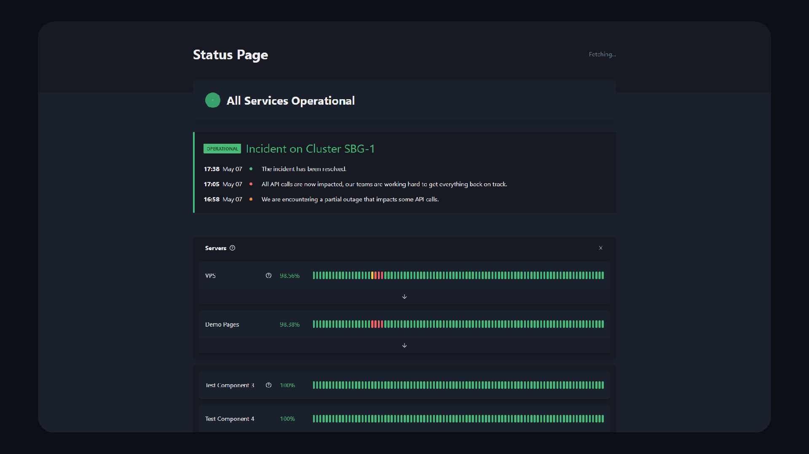

<p align="center">
  
</p>

<br/>

<p align="center">
  <strong>React Frontend for Statusify</strong>
</p>

<p align="center">
  
</p>

<h3 align="center">
  <a href="#getting-started">Getting Started</a>
</h3>

---

## Features
- Serverless Focused (Hash Router Support)
- Latency and Downtime Metric Types Supported
- Internationalization Support ([i18next](i18next.com))
- [Day.JS](https://day.js.org/) Formatting
- Light and Dark mode Support

## Technologies
- [Chakra UI](https://chakra-ui.com/)
- [React Router](https://reactrouter.com/)
## Getting Started

Development:
```bash
$ yarn install
$ yarn start
```

Production
```bash
$ yarn install
$ yarn build
```

